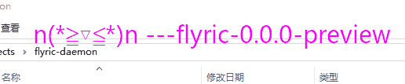

# 这是什么
这是一个正在开发中的flyric歌词显示软件，它通过接收UDP包来调整歌词显示的进度和加载歌词文件



# Release

需要安装服务器和客户端才能运行这个软件，服务器显示歌词，客户端则以插件或库的形式存在于其他的音乐播放器(如[foobar2000](http://www.foobar2000.org))中。

## 服务端

服务端用于显示歌词播放的结果，启动后显示设置界面，并在播放时有托盘图标控制。建议第一次运行时在托盘图标处开启背景透明选项并调整好窗口尺寸。

服务端的设置界面主要有frc歌词所在文件夹的设置、默认字体文件的设置、可用字体所在的文件夹的设置(目前不生效)

服务器启动后自动监听UDP端口。

## 客户端

客户端实际上就是向服务端发送目前播放进度、歌曲名字的程序。源程序位于flyric_client文件夹

### foobar2000插件

通过Release下载插件后，直接在foobar2000的`File->Prefrence->Components`下点击`Install...`按钮安装即可，插件名`Flyric client`，可以随时卸载

可以在配置页面设置是否启用插件(Enable Remote)，是否在控制台打印日志(Enable Console)，服务器的IP及端口号，发送给服务器的歌曲名字(Flyric render name)。

注意，客户端仅单方面地向外界提供播放信息，并不校验自身的网络状态。

### Java包

暂不发布，如有需要，直接用`flyric_client/flyric_client_java`文件夹下的`top.frto027.flyric.FlyricClient`类即可，如果在Android上使用，注意处理好网络和UI线程的逻辑。


# IDE及开发环境
如果想要编译或运行这个软件，我目前使用的开发环境是
```
Windows10 1903
Qt 5.12.3 MinGW 7.3.0 64bit
Intel HD 4600集成显卡或NVIDIA GTX 860M显卡
OpenGL version string: 4.3.0 - Build 20.19.15.4531
```
```
程序需要OpenGL 4.2或以上版本
除Qt的库之外，只有glfw是以库的形式依赖的，其余库直接以源码形式引用，并配置在qt工程文件中,glfw暂时只支持Windows 64位
```

# Udp协议格式
## 程序实现
udp的处理程序位于FlyricWindowThread::datagramReceived函数  
程序只接受外界发来的udp包，并暂时不做任何反馈，一个udp包可以直接表示一个播放进度状态  
## 格式约定
一个数据包中的整数均为四字节大端的，而长整数为八字节大端，字符串全部使用utf-8编码，建议以`\0`结尾。
## id或时间戳
偏移为0的无符号整数  
udp接受顺序不能保证，因此在开头加入时间戳，因为播放以最新状态为准，因此仅处理最新的包。数据包以一个整数开头，表示包的id(或时间戳)，当收到一个数据包后，接下来收到的id-0x7FFFFFFF至id范围内的数据包会被自动忽略。id为0的数据包始终会被处理。例如：
```
当接收到一个数据包id为0x80000005，则接下来如果收到的数据包id为0x00000006至0x80000005中的任意一个，则会自动忽略
当接收到一个数据包id为0x00000009，则接下来如果接收到的数据包id为0x8000000A至0xFFFFFFFF，或0x00000001至0x00000009则会被忽略
当接收到一个数据包id为0x00000000,则接下来接收到的数据包为0x80000001至0xFFFFFFFF中任意一个则自动忽略
```
## 数据包类型
偏移为4的枚举整数，暂时只有正数，详见源码`UDP_DATA_TYPE_*`
### UDP_DATA_TYPE_LOADLYRIC
更换歌词，歌词使用字符串进行标记，字符串偏移为8
### UDP_DATA_TYPE_PAUSE_TIME
暂停播放，需要一个有符号长整数表示歌词暂停时的进度，偏移为8
### UDP_DATA_TYPE_PLAY_TIME
暂停播放，需要一个有符号长整数表示歌曲开始播放时的时钟(一般为系统时钟，实际上是FlyricWindowThread::getTime函数返回值中的某个时间点)，偏移为8
### UDP_DATA_TYPE_PLAY_NOW/UDP_DATA_TYPE_PAUSE_NOW
直接暂停播放，不进行时钟同步，不建议使用

# GLFW hack

以hack代码的方式，修改了小部分GLFW源代码并重新编译，支持Windows下的鼠标穿透功能，当开启背景透明、固定尺寸时默认直接启动鼠标穿透，修改的GLFW见[我的GLFW分支](https://github.com/frto027/glfw/tree/flyric_used_glfw)

# 相关项目
- [QT5](https://www.qt.io/)(配置界面等除OpenGL外的相关UI)
- [Glad](https://github.com/dav1dde/glad-web)(OpenGL函数)
- [GLFW](https://www.glfw.org/)(提供OpenGL环境)
- [flyric_rendergl](https://github.com/frto027/flyric_rendergl)(歌词解码/绘制)
- [FreeType(flyric_rendergl依赖)](https://www.freetype.org/)(字体处理)
